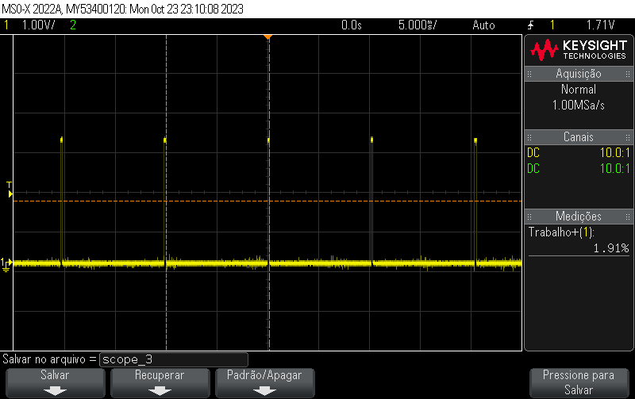
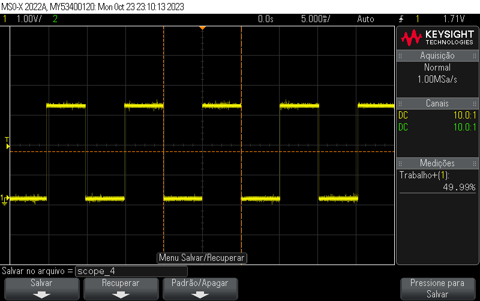
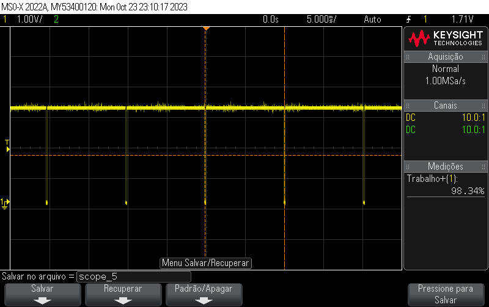
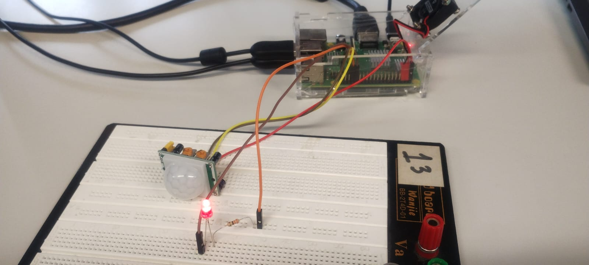

<h1> Prática 4 - SEL0337 </h1>

# Introdução ao uso de periféricos embarcados e GPIO da Raspberry Pi

*Os códigos utilizados em ambas as práticas estão devidamente comentados neste repositório.*

## Uso do PWM para o controle de um LED

### Montagem

A montagem realizada com a Rasp Pi para o controle de um LED com PWM consiste simplesmente em um LED ligado a um dos pinos terra da Rasp Pi e a um resistor que por sua vez está ligado ao pino **21** (BCM).

### Funcionamento do código

Com a utilização do pacote **RPi.GPIO**, o programa implementado (**LED_PWM.py**) é capaz de controlar a luminosidade do LED da seguinte maneira: o duty cycle do PWM é requerido no terminal (função **input()**) e esse valor inteiro é dado como argumento para a função **Changeduty cycle**, que é um dos campos do objeto PWM. 

Além de observar a luminosidade do LED, a tensão entre os terminais foi capturada com o osciloscópio. Abaixo estão as leituras obtidas para um duty cycle de 1%, 50% e 99%, nessa ordem.

## Sensor de presença

### Montagem

A montagem realizada utilizou a Rasp Pi, um sensor de presença infravermelho **PIR HC-SR501** e um LED. O sensor foi devidamente ligado à alimentação e o pino de saída foi ligado ao pino **19** (BCM) da Rasp Pi. Já o LED, foi ligado ao pino **12** (BCM) em série com um resistor devidamente dimensionado.

### Funcionamento do código

O código **SensorPres.py** funciona da seguinte maneira: Na atribuição dos pinos com o pacote de alto nível gpiozero, é passado para o objeto MotionSensor o pino com o sinal do sensor e o limiar (threshold) de ativação. Por tentativa e erro, o valor de threshold = .6 mostrou-se apropriado.

A rotina do código implementado consiste em esperar pela ausência de movimento (com a função **wait_for_no_motion()** do objeto MotionSensor), printar uma mensagem e desligar o led. Então espera-se pelo movimento (com a função **wait_for_motion()**), após o qual o led é ligado, requisita-se uma entrada com a função **input()** e, caso esteja correta, o led é desligado novamente.